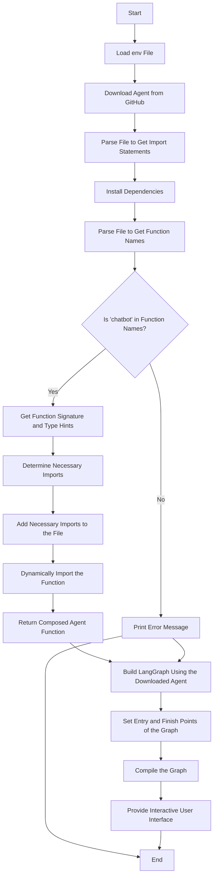

# Dynamic Agent Importer and LangGraph Builder


## Purpose

This program dynamically downloads, imports, and utilizes a Python function from a remote GitHub repository as LangGraph agent. It analyzes the module to install necessary dependencies, import required modules, and dynamically create instances of functions or classes, particularly focusing on Pydantic models. The program builds a graph using the dynamically imported functions and provides an interactive interface for users to interact with the imported agent.

## Functionality

1. **Download and Save File from GitHub**: Downloads a Python file from a specified GitHub URL and saves it locally.
2. **Extract and Add Imports**: Parses the downloaded file to extract required imports and adds them to the file.
3. **Install Dependencies**: Installs the required Python packages listed in the import statements of the downloaded file.
4. **Function Analysis**: Extracts function names and their type hints from the downloaded file.
5. **Dynamic Import**: Dynamically imports the specified function from the downloaded file.
6. **Build LangGraph**: Uses the dynamically imported function to build a LangGraph and provides an interactive interface for user interaction.

## Architecture

The architecture of the program consists of several key components:

1. **Downloader**:
    - `download_file_from_github(url, save_path)`: Downloads the Python file from GitHub.

2. **File Modifier**:
    - `add_imports_to_file(file_path, imports)`: Adds necessary import statements to the downloaded file.

3. **Analyzer**:
    - `get_function_names(file_path)`: Extracts function names from the file.
    - `get_imports(file_path)`: Extracts import statements from the file.
    - `get_function_signature_and_types(file_path, function_name)`: Extracts type hints and function signatures.

4. **Installer**:
    - `install_dependencies(modules)`: Installs Python packages required by the file.

5. **Dynamic Importer**:
    - `dynamic_import(module_name, function_name)`: Dynamically imports the specified function from the module.

6. **LangGraph Builder**:
    - `determine_needed_imports(type_hints)`: Determines the necessary import statements based on type hints.
    - `download_and_import_agent()`: Orchestrates the process of downloading, modifying, analyzing, installing, and importing the agent function.

## Flow



## Issues

- Agent Dependencies:
  - Find
  - List
  - Install
  - Public and private dependencies
- Graph state
  - Does Agent request more fields are put in StateGraph?
  - Does Agent get unfettered access to StateGraph?
  - Is a 3P Agent on a subgraph of its own due to security concerns?
- API Access:
  - What if Agent needs access to, say, a database?

 	

## Usage

1. Ensure you have the necessary environment variables set in a `.env` file.
2. Run the program using:
    ```bash
    python main.py
    ```
3. Interact with the agent through the provided interactive interface.

## Installation

Make sure to install the required packages using Poetry:
```bash
poetry install
```

## Related Projects

- [LangGraph](https://github.com/langchain-ai/langgraph)

## License

This project is licensed under the Apache 2.0 License. See the LICENSE file for details.

## Contact

For any questions or feedback, please reach out to [your email address].